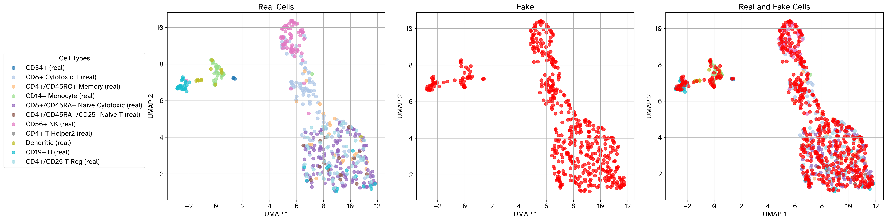
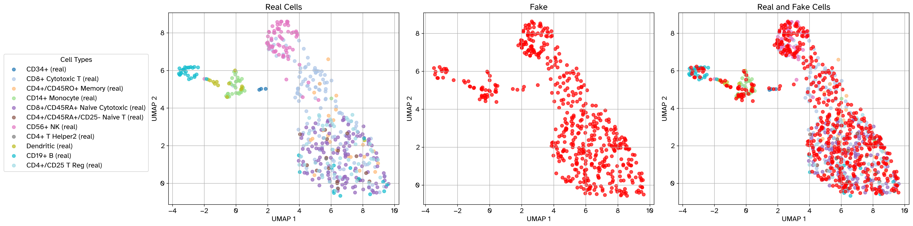
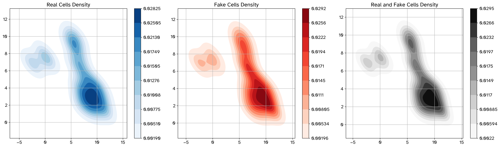
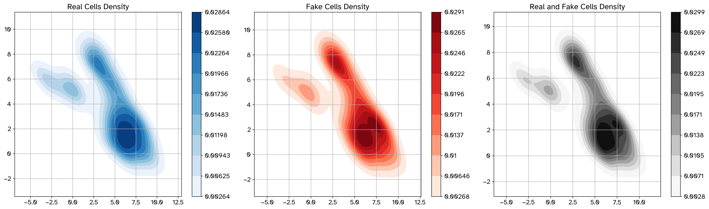

Tutorial 
========

CLI
---

GRouNdGAN comes with a command-line interface. This section outlines available commands and arguments.

To use the CLI, run the ``src/main.py`` script with the desired command and any applicable options.

.. important::

    Use :code:`python3.9` instead of :code:`python` if you're running through docker or singularity.
    
.. code-block:: bash 

    $ python src/main.py --help
    usage: GRouNdGAN [-h] --config CONFIG [--preprocess] [--create_grn] [--train] [--generate] [--evaluate] [--benchmark_grn] [--perturb]

    GRouNdGAN is a gene regulatory network (GRN)-guided causal implicit generative model for
    simulating single-cell RNA-seq data, in-silico perturbation experiments, and benchmarking GRN
    inference methods. This programs also contains cWGAN and unofficial implementations of scGAN and
    cscGAN (with projection conditioning)

    required arguments:
    --config CONFIG  Path to the configuration file

    optional arguments:
    --preprocess     Preprocess raw data for GAN training
    --create_grn     Infer a GRN from preprocessed data using GRNBoost2 and appropriately format as causal graph
    --train          Start or resume model training
    --generate       Simulate single-cells RNA-seq data in-silico
    --evaluate       Evaluate the data quality of the simulated dataset
    --benchmark_grn  Evaluate the performance of a GRN inference method in inferring the ground truth GRN
    --perturb        Perform a perturbation experiment using a trained GRouNdGAN model
    
There are essentially seven commands available: ``--preprocess``, ``--create_grn``, ``--train``, ``--generate``, ``--evaluate``, ``benchmark_grn``, and ``perturb``. You must provide a configuration file containing inputs, parameters, and hyperparameters with each command through the ``--config`` flag. 

.. note:: 

    You can run commands individually:

    .. code-block:: console

        python src/main.py --config configs/causal_gan.cfg --preprocess

    Or chain them together to run all or multiple steps in one go:

    .. code-block:: console

        python src/main.py --config configs/causal_gan.cfg --preprocess --create_grn --train --generate --evaluate

    When chaining multiple commands, ensure that the supplied configuration file includes the required arguments for each command in the chain. 

Config Files
------------

GRouNdGAN uses a configuration syntax similar to INI implemented by python's `configparser <https://docs.python.org/3/library/configparser.html#module-configparser>`_ module. 

We provide three sample config files in the ``configs/`` directory: 

* ``causal_gan.cfg``: for GRouNdGAN
* ``conditional_gan.cfg``: for cscGAN with projection conditioning (Marouf et al., 2020) and cWGAN. 
* ``gan.cfg``:  for scGAN (Marouf et al., 2020) (we use this to train GRouNdGAN's causal controller)

Most of the configuration file consists of hyperparameters. You mostly need to modify input and output parameters which we will go through in each section. GRouNdGAN isn't very sensitive to hyperparameters. However, it is still advisable to test different choices of hyperparameters using a validation set. 

Below is the demo ``causal_gan.cfg`` config file for training GRouNdGAN using the PBMC68k dataset:

.. include:: causal_gan_cfg.rst

Project outline
---------------
GRouNdGAN is structured as follows:

.. include:: tree.rst

Demo Datasets
-------------

The provided docker image comes prepackaged with the unprocessed Mouse BoneMarrow (Paul et al., 2015) and Human PBMC68k (Zheng et al., 2017) datasets (``data/raw/PBMC`` and ``data/raw/BoneMarrow``) and human and mouse TFs, downloaded from AnimalTFDB (``data/raw/Homo_sapiens_TF.csv`` and ``data/raw/Mus_musculus_TF.csv``).  

.. note:: 

    If you have opted for a local installation, you can download these files from `here <https://nextcloud.computecanada.ca/index.php/s/pXKQ2isr47AwKEX>`_ and place them in ``data/raw/``.

    You can also do this in bash (you need curl and tar installed): 

    .. code-block:: bash

        curl https://nextcloud.computecanada.ca/index.php/s/WqrCqkH5zjYYMw9/download --output demo_data.tar &&
        tar -xvf demo_data.tar -C data/raw/ &&
        mv data/raw/demo/* data/raw &&
        rm demo_data.tar &&
        rm -rf data/raw/demo/

Steps 
-----

Preprocessing 
~~~~~~~~~~~~~
.. attention:: 
    Don't skip the preprocessing step, GRouNdGAN requires library-size normalized data as input. 

To run our preprocessing pipeline, your config file should contain the following arguments: 

.. code-block:: ini

    [EXPERIMENT]

        [Preprocessing]
        ; set True if data is 10x (like PBMC)
        ; set False if you're providing an .h5ad file (like BoneMarrow.h5ad)
        10x = True

        ; If 10x = True, path to the directory containing matrix.mtx, genes.tsv, and barcodes.tsv
        ; If 10x = False, path to the .h5ad file containing the expression matrix
        raw = data/raw/PBMC/ 

        validation set size = 1000 ; size of the validation set to create
        test set size = 1000 ; size of the test set to create 
        annotations = data/raw/PBMC/barcodes_annotations.tsv ; optional, leave empty if you don't have annotations
        min cells = 3 ; genes expressed in less than 3 cells are discarded
        min genes = 10 ; cells with less than 10 genes expressed are discarded
        library size = 20000 ; library size used for library-size normalization
        louvain res = 0.15 ; Louvain clustering resolution (higher resolution means finding more and smaller clusters)
        highly variable number = 1000 ; number of highly variable genes to identify
    
        [Data]
        train = data/processed/PBMC/PBMC68k_train.h5ad ; path to output the train set
        validation = data/processed/PBMC/PBMC68k_validation.h5ad ; path to output the validation set
        test = data/processed/PBMC/PBMC68k_test.h5ad ; path to output the test set
        number of genes = 1000

Then, run the following::

   $ python src/main.py --config configs/causal_gan.cfg --preprocess

Once completed, you will see a success message. Train, validation, and test sets should be created in the paths defined under the ``[Data]`` section of the config file.

**Expected output:**

.. code-block:: text
    
    Successfully preprocessed and and saved dataset.
    Train set: data/processed/PBMC/PBMC68k_train.h5ad
    Validation set: data/processed/PBMC/PBMC68k_validation.h5ad
    Test set: data/processed/PBMC/PBMC68k_test.h5ad

GRN Creation 
~~~~~~~~~~~~

.. note:: 
    GRN creation isn't needed for scGAN, cscGAN, and cWGAN; you can skip the ``--create_grn`` command. 

This command uses GRNBoost2 (Moerman et al., 2018) to infer a GRN on the preprocessed train set. It then converts it into the a format that GRouNdGAN accepts.  

In addition to what was required in the previous step, you need to provide the following arguments:

.. code-block:: ini

    [GRN Preparation]
    TFs = data/raw/Homo_sapiens_TF.csv
    k = 15 ; k is the number of top most important TFs per gene to include in the GRN 
    Inferred GRN = data/processed/PBMC/inferred_grnboost2.csv

    ; "top" for selecting top k edges
    ; "pos ctr" for generating positive control GRNs (even indices 0, 2, 4... = top 1, 3, 5, ...)
    ; "neg ctr" for generating negative control GRNs (odd indices 1, 3, 5... = top 2, 4, 6, ...)
    ; note that k has to be a pair number for strategy=ctr
    strategy = top 

    [Data]
    causal graph = data/processed/PBMC/causal_graph.pkl ; where to write the created GRN

By default, the top k most important regulating TFs of each gene will be included in the GRN (``strategy = top``). Alternatively, you can construct two separate GRNs, each containing half of these top k TFs per gene. By first setting ``strategy = neg ctr`` and then ``strategy = pos ctr``, you generate two GRNs with identical densities and structural properties, based on the odd/even positions of the TFs in each gene’s ranked list. This strategy can be useful for controlled comparative analyses as both GRNs are equally sparse and are derived from the same underlying ranking.

Run using::

   $ python src/main.py --config configs/causal_gan.cfg --create_grn

Once done, you will see success messages and the properties of the created GRN.

**Expected output:**

.. code-block:: text

    Using 63 TFs for GRN inference.
    preparing dask client
    parsing input
    creating dask graph
    4 partitions
    computing dask graph
    shutting down client and local cluster
    finished
    Successfully saved GRN inferred by GRNBoost2 GRN to data/processed/PBMC/inferred_grnboost2.csv

    Causal Graph
    -----------------  ------------
    TFs                   63
    Targets              937
    Genes               1000
    Possible Edges     59031
    Imposed Edges      14055
    GRN density Edges      0.238095
    -----------------  ------------
    Successfully saved GRouNdGAN causal graph to data/processed/PBMC/causal_graph.pkl
    
The causal graph will be written to the path specified by ``[Data]/causal graph`` in the config file.

Imposing Custom GRNs 
^^^^^^^^^^^^^^^^^^^^

It is possible to instead impose your own GRN onto GRouNdGAN. If you're opting for this option, skip the ``--create_grn`` command. Instead, create a python dictionary where keys are gene indices (``int``). For each key (gene index), the value is the set of indices ``set[int]`` coresponding to TFs that regulate the gene. 

.. image:: _static/sampleGRN.svg

The GRN in the picture above can be written in dictionary form as: 

.. code-block:: python

    causal_graph = {
        "G2": {"TF2", "TFn"}, 
        "G1": {"TF1"}, 
        "Gn": {"TF2", "TF1"},
        "G3": {"TFn", "TF1"}
    }

Converting the key/value pairs into gene/TF indices, it becomes

.. code-block:: python

    causal_graph = {
        1: {4, 5}, 
        3: {0}, 
        6: {4, 0}, 
        2: {5, 0}
    }

Then, pickle the dictionary:

.. code-block:: python

    import pickle

    with open("path/to/write/causal_graph.pkl", "wb") as fp:
        pickle.dump(causal_graph, fp, protocol=pickle.HIGHEST_PROTOCOL)

Don't forget to edit the causal graph path in the config file. 

.. code-block:: ini

    [Data]
    causal graph = path/to/write/causal_graph.pkl

* The GRN must be a directed bipartite graph
* All genes and TFs in the dataset must appear in the dictionary either as key (target gene) or value (as part of the set of TFs)  

.. Warning:: 

    Construct a biologically meaningful GRN!

    Imposing a GRN with significantly different TF-gene relationships from those observable in the reference dataset will deteriorate the quality of simulated cells as generating realistic simulated datapoints and imposing the GRN will act as contradictory tasks

Training 
~~~~~~~~

You can start training the model using the following command::

    $ python src/main.py --config configs/causal_gan.cfg --train

Upon running the command above, three folders will be created inside the path provided in the config file (``[EXPERIMENT]/output directory``) and the config file will be copied over:

* ``checkpoints/``: Containing the ``.pth`` state dictionary including model's weights, biases, etc.
* ``TensorBoard/``: Containing TensorBoard logs (saved as tfevent files)
* ``TSNE/``: Containing t-SNE plots of real vs simulated cells 

You can change the save, logging, and plotting frequency (``[Training]/save frequency``, ``[Training]/summary frequency``, ``[Training]/plot frequency``) in the config file. 

Monitor training using TensorBoard::

    tensorboard --logdir="{GAN OUTPUT DIR HERE}/TensorBoard" --host 0.0.0.0 --load_fast false &

We also provide two slurm submission scripts for training and monitoring in  ``scripts/``.

**Expected output:**

.. code-block:: text

    Done training causal controller step 0
    Done training causal controller step 1
    Done training causal controller step 2
    ...
    Done training causal controller step 10000
    Saved logs
    Saved t-SNE plot
    Done training causal controller step 10001
    ...
    Done training causal controller step 200000
    Saved logs
    Saved t-SNE plot
    Saved checkpoint
    Done training GRouNdGAN step 0
    Done training GRouNdGAN step 1
    Done training GRouNdGAN step 2
    ...
    Done training GRouNdGAN step 10000
    Saved logs
    Saved t-SNE plot
    Done training GRouNdGAN step 10001
    ...
    Done training GRouNdGAN step 100000
    Saved logs
    Saved t-SNE plot
    Saved checkpoint
    ...
    Done training GRouNdGAN step 1000000
    Saved logs
    Saved t-SNE plot
    Saved checkpoint
    Finished training

.. note::
    * Training time primarily depends on the number of genes and the density of the imposed GRN. It takes about five days with a very dense GRN (~20% density) containing 1000 genes on a single NVidia V100SXM2 (16G memory) GPU. 

    * GRouNdGAN supports multi-GPU training, but we suggest sticking to a single GPU to avoid excess overhead. 

    * GRouNdGAN trains for a million steps by default. It is not recommended to change this in the config file. 

    * You can resume training from a checkpoint by setting ``[EXPERIMENT]/checkpoint`` in the config file to the ``.pth`` checkpoint you wish to use. 

In-silico Single-Cell Simulation
~~~~~~~~~~~~~~~~~~~~~~~~~~~~~~~~

One training is done, populate the ``[EXPERIMENT]/checkpoint`` field with the path of the ``.pth`` checkpoint you want to use in the config file (usually the latest). 

.. code-block:: ini 

    [EXPERIMENT]
    output directory = results/GRouNdGAN
    device = cuda ; we will let the program choose what is available
    checkpoint = results/GRouNdGAN/checkpoints/step_1000000.pth 

You can change the number of cells to simulate in the config file (10000 by default)

.. code-block:: ini
    
    [Generation]
    number of cells to generate = 10000
    generation path ; will save to [Experiment]/output directory/simulated.h5ad if left undefined

Then run

.. code-block:: sh

    $ python src/main.py --config configs/causal_gan.cfg --generate

This will output a ``simulated.h5ad`` file to ``[EXPERIMENT]/output directory`` containing the simulated expression matrix. 

**Expected output:**

.. code-block:: text

    Simulated cells saved to results/GRouNdGAN/simulated.h5ad

Evaluating Simulated Data Quality
~~~~~~~~~~~~~~~~~~~~~~~~~~~~~~~~~

You can evaluate the quality of GRouNdGAN simulations using the following quantitative and qualitative metrics:

* t-SNE plot of jointly embedded experimental and simulated cells.
* Euclidean distance between the mean expression profiles of experimental and simulated cells.
* Cosine distance between the mean expression profiles of experimental and simulated cells.
* ROC curve and AUROC of Random Forest classifier distinguishing experimental from simulated cells.
* Maximum Mean Discrepancy (MMD) for assessing distributional similarity between experimental and simulated cells.
* Mean integration local inverse Simpson's index (miLISI) of experimental and simulated cells.

The above metrics are computed between the test set and an equal number of cells sampled from the simulated data. In the t-SNE plot, greater overlap between experimental and simulated cells indicates better match. For the first three quantitative metrics (Euclidean distance, Cosine distance, and MMD), lower values reflect greater similarity. For the RF AUROC, values closer to 0.5 indicate that the classifier struggles to distinguish between simulated and experimental cells, which implies more realistic simulated data. For miLISI, values closer to 2 suggest better mixing of experimental and simulated cells. As a control, we also compute the Euclidean distance, Cosine distance, MMD, and miLISI metrics between two halves of the reference test set to serve as a point of comparison.

You can specify which evaluation metrics to compute by setting the appropriate flags in the configuration file. 

.. code-block:: ini

    [Evaluation]
    simulated data path ; will use [Generation]/generation path if left undefined
    plot tsne = True ; Note: has to be true in order to run miLISI
    compute euclidean distance = True  ; or False
    compute cosine distance = True 
    compute rf auroc = True
    compute MMD = True
    compute miLISI = True ; plot tsne has to be True for this to work

To run the evaluation with the specified configuration, use the following command:

.. code-block:: sh

    $ python src/main.py --config configs/causal_gan.cfg --evaluate

**Expected output:**

.. code-block:: text

    t-SNE plot saved to results/GRouNdGAN/tSNE.png

    Euclidean distance (real vs fake): 171.218017578125
    Euclidean distance (control): 242.84738159179688

    Cosine distance (real vs fake): 0.0003756880760192871
    Cosine distance (control): 0.0007848143577575684

    RF ROC plot saved to results/GRouNdGAN/RF.png
    RF AUROC: 0.5410462687230544

    MMD (real vs fake): 0.03008744777663175
    MMD (control): 0.06244054076970418

    miLISI (real vs fake): 1.89692891595357
    miLISI (control): 1.8900128524031679

.. list-table::
   :widths: 50 50
   :header-rows: 0

   * - .. figure:: _static/tSNE.png
          :width: 100%
   
          Example saved t-SNE plot

     - .. figure:: _static/RF.png
          :width: 100%

          Example saved RF ROC plot

Benchmarking Inferred GRNs
~~~~~~~~~~~~~~~~~~~~~~~~~~

This command evaluates the reconstructed GRN (from GRouNdGAN-simulate data) against the ground truth GRN (used for simulation).

Configuration file arguments:

.. code-block:: ini
    
    grn to benchmark = path/to/inferred/grn.csv
    ground truth save path = data/generated/
    plots save path = notebooks/generated/
    compute precision at k = True
    k = 15
    compute pr = True

You will need to provide the path to the inferred GRN (``[GRN Benchmarking]/grn to benchmark``). The GRN has to be a tab-separated ``.csv`` file with three columns in this order: 

1. TF
2. Gene
3. importance
   
Headers are optional — only column order matters.

**Example inferred GRN csv:**

.. code-block:: text

    Gata1	Hbb-bs  0.89
    Tal1	Hbb-bs	0.74
    Gata2	Gfi1b	0.52

If enabled via the configuration file, the benchmarking command will generate one or both of the following plots, saved to the directory specified in ``[GRN Benchmarking]/plots save path``:

1. **Precision@k**
    If ``[GRN Benchmarking]/compute precision at k = True``, measures how many of the top-k (specified by ``[GRN Benchmarking]/k``) inferred TFs for a gene are actually true regulators according to the ground truth. 

2. **Precision-Recall (PR) Curve**
    If ``[GRN Benchmarking]/compute pr = True``, a global Precision-Recall curve will be computed across all predicted edges in the GRN.

Both plots are saved as ``.png`` files, and any associated metrics (e.g., precision scores, AUPRC) are printed to the console. 

Then run: 

.. code-block:: sh

    $ python src/main.py --config configs/causal_gan.cfg --benchmark_grn

**Expected output:**

.. code-block:: text

    Saved ground truth GRN to data/generated/ground truth GRN.csv

    Inferred GRN precision at k: [1.0, 0.9983425414364641, 0.9918968692449356, 0.9820441988950276, 0.9703867403314917]
    Baseline precision at k: [0.010526315789473684, 0.021052631578947368, 0.031578947368421054, 0.042105263157894736, 0.05263157894736842]
    Saved precision at k plot at results/GRouNdGAN/Top_TF_precision.png

    Inferred GRN AURPC: 0.71
    Baseline AUPRC (random predictor): 0.15789473684210525
    Saved PR curve at results/GRouNdGAN/PR_curve.png

.. list-table::
   :widths: 50 50
   :header-rows: 0

   * - .. figure:: _static/PR_curve.png
          :width: 100%
   
          Example PR curve plot

     - .. figure:: _static/Top_TF_precision.png
          :width: 100%

          Example precision at K plot

Exporting Ground Truth GRN 
^^^^^^^^^^^^^^^^^^^^^^^^^^

If you specify ``[GRN Benchmarking]/ground truth save path``, the ground truth GRN will be exported as a CSV:

.. code-block:: text

    TF (regulator),Gene (target)
    Gata1,Hbb-bs
    Tal1,Hbb-bs
    ...

This can be useful for reference or external benchmarking tools.

Perturbation Studies 
~~~~~~~~~~~~~~~~~~~~
Once trained, GRouNdGAN can sample from interventional distributions and perform in-silico TF perturbation experiments. These perturbations are applied to the same batch of cells, enabling matched case-control comparisons.

To run a perturbation, simply specify the list of TFs to perturb (``[Perturbation]/tfs to perturb``) and the corresponding values to which they should be set (``[Perturbation]/perturbation values``). The below configuration knocks out IRF8 and sets CEBPA to the value 100.2. The items in the list are separated by a space.

.. code-block:: ini 

    [Perturbation]
    save dir = data/generated/

    ; tfs to perturb and perturbation values are paired. The two lists need to be of the same size.
    tfs to perturb = IRF8 CEBPA ;= TF names separated by a space (ex: IRF8 CEBPA)
    perturbation values = 0 100.2 ;= Float values separated by a space to set respecive TF in tfs to perturb (ex: 0 100.2) 

.. attention:: 
    Make sure perturbation targets (``[Perturbation]/tfs to perturb``) exist in the dataset and causal graph.

Once the configuration file is ready, run:

.. code-block:: sh

    $ python src/main.py --config configs/causal_gan.cfg --perturb

**Expected output:**

.. code-block:: text

    Loaded GAN
    Using checkpoint at results/GRouNdGAN/checkpoints/step_1000000.pth
    Saved cells before and after perturbation to data/generated/

The cells before and after perturbation will be saved as ``after_perturbation.h5ad`` and ``before_perturbation.h5ad`` in the specified directory for secondary analysis.

   Example scatter plot before perturbation

   Example scatter plot after perturbation

   Example density plot before perturbation

   Example density plot after perturbation

References
----------

Marouf, M., Machart, P., Bansal, V., Kilian, C., Magruder, D. S., Krebs, C., & Bonn, S. (2020). Realistic in silico generation and augmentation of single-cell RNA-seq data using generative adversarial networks. Nature Communications, 11(1). https://doi.org/10.1038/s41467-019-14018-z

Paul, F., Arkin, Y., Giladi, A., Jaitin, D. A., Kenigsberg, E., Keren-Shaul, H., Winter, D. R., Lara-Astiaso, D., Gury, M., Weiner, A., David, E., Cohen, N., Lauridsen, F. K. B., Haas, S., Schlitzer, A., Mildner, A., Ginhoux, F., Jung, S., Trumpp, A., . . . Tanay, A. (2015). Transcriptional heterogeneity and lineage commitment in myeloid progenitors. Cell, 163(7), 1663–1677. https://doi.org/10.1016/j.cell.2015.11.013

Zheng, G., Terry, J. M., Belgrader, P., Ryvkin, P., Bent, Z., Wilson, R. J., Ziraldo, S. B., Wheeler, T. D., McDermott, G. P., Zhu, J., Gregory, M., Shuga, J., Montesclaros, L., Underwood, J. G., Masquelier, D. A., Nishimura, S. Y., Schnall-Levin, M., Wyatt, P., Hindson, C. M., . . . Bielas, J. H. (2017). Massively parallel digital transcriptional profiling of single cells. Nature Communications, 8(1). https://doi.org/10.1038/ncomms14049

Moerman, T., Aibar, S., González-Blas, C. B., Simm, J., Moreau, Y., Aerts, J., & Aerts, S. (2018). GRNBoost2 and Arboreto: efficient and scalable inference of gene regulatory networks. Bioinformatics, 35(12), 2159–2161. https://doi.org/10.1093/bioinformatics/bty916
